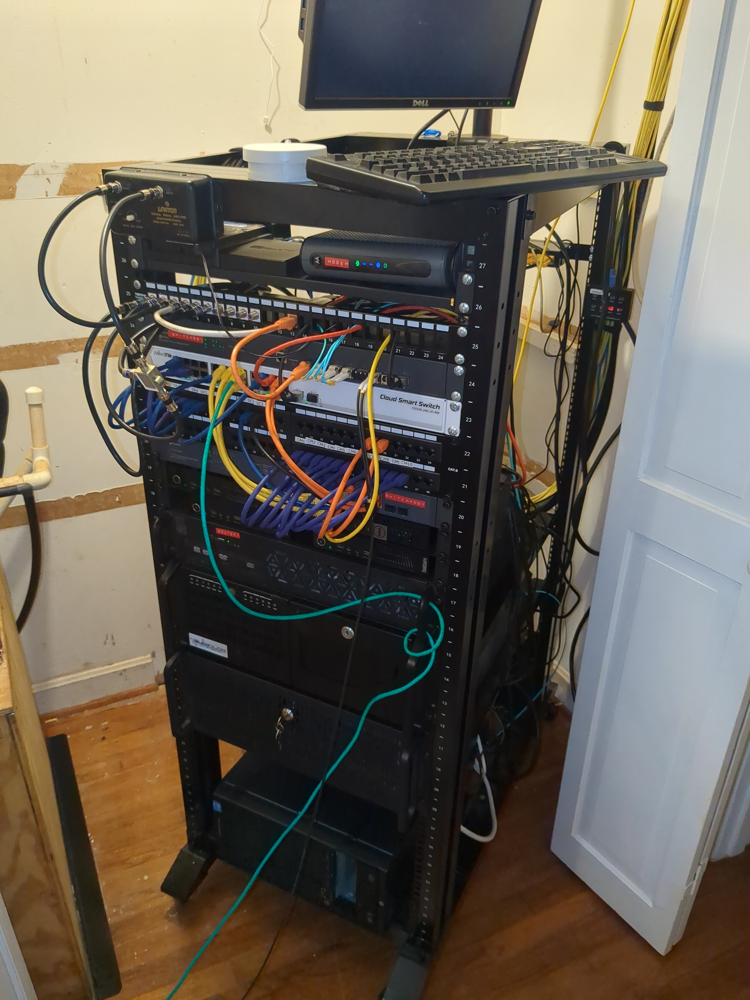
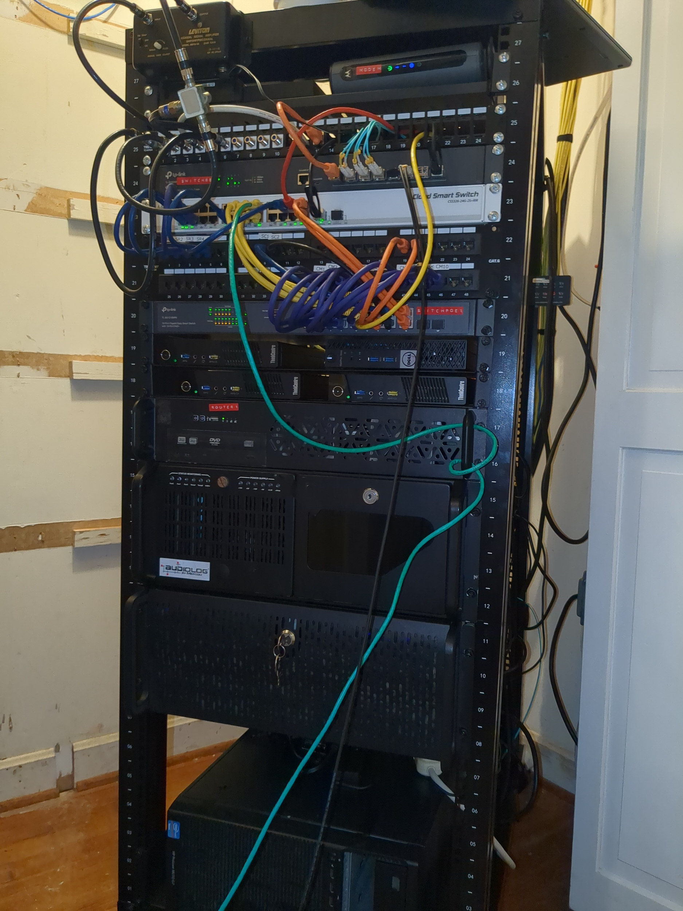

+++
title = 'Home Lab'
date = 2024-07-23T09:11:51-04:00
draft = true
+++

My current home lab consists of 6 Linux servers, dual redundant OPNsense routers, 8 VLANS, an enterprise grade 10g fiber network, and countless containerized local services. I also operate my own email server, which is not nearly as simple to do as it used to be 15-20 years ago, but it is still a fun challenge! 

I have a RTX 3060 12GB in one of my Linux servers (starfox) that I use for ML acceleration for a variety of purposes including security, family history, and just general ML fun. 

Pictures below show the current state of the lab. This is without a doubt the cleanest lab I have ever had setup. There is still a ton I want to do with it, and lots of ethernet and fiber drops I need to put in the house, but as of this writing, its summer in southeast Georgia and I don't wanna stroke out in the attic lol.

